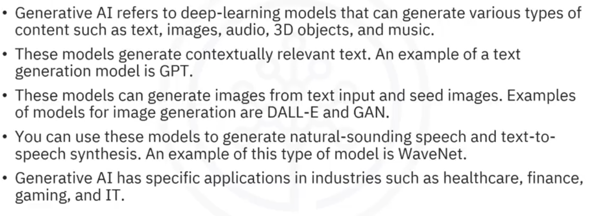

### Transformers
- 3 basic concepts : Tokenization -> Embedding -> Positional Encoding -> Inference -> Output Probabilities
- good article : https://medium.com/@waylandzhang/transformer-architecture-llms-zero-to-hero-98b1ee51a838

#### Usage in LLMs
- As a `BaseModel` : Pretrained on massive datasets
- As a `Fine-Tuned Model` : fine tuned on domain and optionally also includes reinforcement learning from human feedback (e.g : GPT3+)

#### Training Procedure
1. `Tokenization` : refers to converting words / characters into numbers based on a vocabulary of say size V. e.g. : [HuggingFace example](https://huggingface.co/datasets/goendalf666/sales-textbook_for_convincing_and_selling) has V of size 100069.
2. `Embedding` : convert tokens to d sized vector based on a lookup. Lookup table is of size `V x d`, each embedded representation is of size `1 x d`.
3. `Input Batch` :   
    a. A set of sentences are chosen in a batch with a defined `context length`, which is the max size of a sentence. Say we have `B x C`, where B is the batch size, C the context length.   
    b. For each sentence / element in the batch, build the embedding using the lookup. Each sentence of size `C x 1` gets converted to `C x d` after lookup.   
    c. Do this for all sentences, and we end up with `B x C x d` tensor for input sentences of size `B x C`.
4. `Positional Encoding` : describes the location or position of an entity in a sequence so that each position is assigned a unique representation. and closer elements are close. The lookup is of size `C x d`. This is added to each batch element from the batch of size `B x C x d`.
    a. last dimension indicates approx where a token is located (start / end)
    b. second last localizes a bit more, next one bit more, and so on.
    c. good reference - https://youtu.be/1biZfFLPRSY?t=408
    d. Recent works have tried concatenating this (increases param count) or learning it (BERT, RoBERTa, ViT). FNet hand-crafts it Fourier style. video : https://youtu.be/M2ToEXF6Olw?t=350

### Basic Architecture
3 blocks:
- multi-headed attention
- layer normalization
- feed forward block

#### Masked Multi-headed attention
- input `X` (dimension `B x C x d`) is passed through 3 linear layers `W_k`, `W_q`, `W_v` (dimension `d x d`) to get `K`, `Q` and `V` (dimension `B x C x d`).
- Each of `K`, `Q` and `V` are then reshaped to `B x C x N x d/N`, i.e, each sentence in a batch has a token context length `C`, each token is passed through `N` heads of dimensionality `d/N`.
- Reshape this to `B x N x C x d/N`, and then get Attention `A = softmax(mask(QK^T/sqrt(d_key))) * V`, where `d_key = d/N`.
- `mask` ensures to zero output future contexts for the decoder so that decoder is forced to be causal. Then softmax is applied on last dimension `torch.softmax(..., dim=-1)` to ensure each row sums to 1.
- finally get V attention, i.e, matrix multiply softmax output by `V`. Reshape output to `B x C x N x d/N`, and then concat, followed by reshape to `B x C x d`.
- at this stage attention output is now back to same size as input `X`. Multiply reshaped V attention with `Wo` (dimension `d x d`).

#### feed forward block
- consists of `FC1 -> ReLU -> FC2`
- `FC1` expands dim by 4, `FC2` brings it back to original size
```
# Feed Forward Block
output = nn.Linear(d, d * 4)(output)
output = nn.ReLU()(output)
output = nn.Linear(d * 4, d)(output)
```
#### Output block
- Map output back to vocabulary size to get logits (`B x C x V`).
```
logits = nn.Linear(d, V)(output)
```
- each sentence in the batch then has a mapping between context to vocabulary.

### Generative AI

