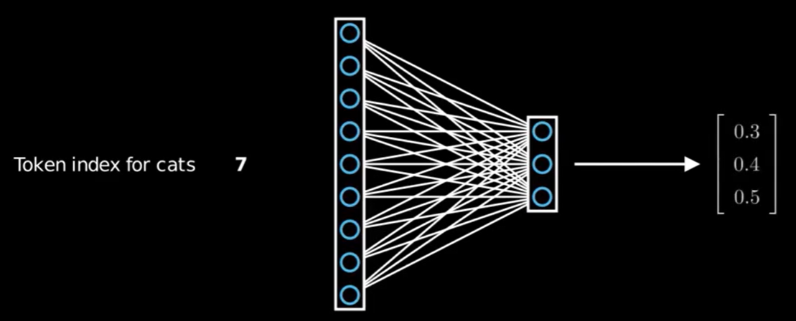
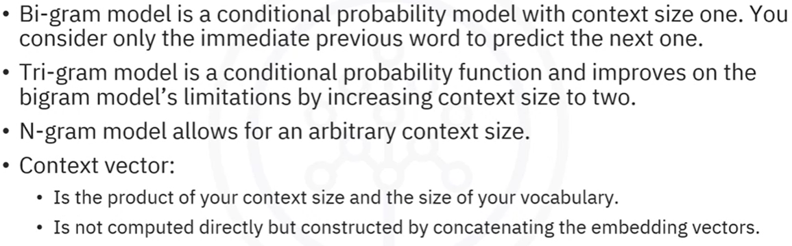

### Overview
- one-hot encoding and bag of words
- embeddings and embeddings bags

#### One-hot encoding
- Token index to one-hot encoding

#### Bag of words
- combine one-hot encoded word into a one-hot encoded sentence, i.e, captures a document as aggregate of avg of one-hot encoded vectors.
- when fed into a NN, output is sum of the embeddings

#### Embedding layer
- replaces Linear layers that would accept a one-hot encoded input
- accepts the token index and produces an embedding representation similar to what Linear layers would have with the one-hot encoded input.


#### Embedding Matrix
- embedding weights are combined, 1 row per word from the vocabulary, into a matrix.
- Number of cols is the embedding dimension.
- Typically, embedding vectors (i.e, row of a embedding matrix) have lower dimensionality than one-hot representation. Simplifies computation!
- Effectively, sentence is sum of all one-hot vectors to form bag of words rep, and multiply that with Embedding matrix.
- This can be done with Embedding Bag layer. Input is tokens, output is sum of word embeddings.

```
dataset = [
...
...
...
]
# build tokenizer
tokenizer_en = get_tokenizer('spacy', language='en_core_web_sm')

def yield_tokens(sentence):
  for word in sentence:
    yield get_tokenizer(word)

data_iter = yield_tokens(dataset)

# get vocab
vocab = build_vocab_from_iterator(yield_tokens(dataset), specials=["<unk>"])

# Tokens and indices
input_ids = lambda x : [torch.tensor(vocab(tokenizer(data_sample))) for data_sample in dataset]
index = input_ids(dataset)

# Create embedding layer
embedding_dim = 3
n_embeddings = len(vocab)
embeds = nn.Embedding(n_embedding, embedding_dim)

# test embedding output
embed_sentence_0 = embeds(index[0])
print(embed_sentence_0)

# Create Embedding Bag layer
embedding_bag = nn.EmbeddingBag(n_embedding, embedding_dim)
# this requires an offset input which is location of the sentence, use index to derive this
index_flat = torch.cat(index)
# use len of index and cumsum it to get position
offset = [len(sample) for sample in index]
offset.insert(0, 0)
offset = torch.cumsum(offset, 0)[0:-1]
# finally get embeddings - average of word embeddings
my_embeddings = embedding_bag(index_flat, offsets=offset)
```

#### Bi-gram, Tri-gram and N-gram

